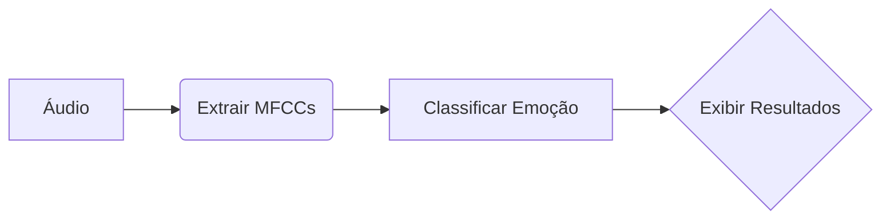

# Projeto Final: Sistema Multimodal de Análise de Voz

## Objetivo
Estender o Projeto 3 com funcionalidades de:
- 🎤 Reconhecimento de voz (input por microfone).
- 😊 Deteção de emoções baseada em características acústicas.

## Requisitos Funcionais
### Input
- 4 frases pré-definidas (ex: "Estou muito satisfeito com este serviço!").

### Output
1. **Transcrição Corrigida**  
   Ex: "Estou satisfeito com este serviço!" (remove redundância).
2. **Emoção Detectada**  
   - `Alegria` (intensidade: 82%).

## Requisitos Técnicos
### Tecnologias
- **Reconhecimento de Voz**:  
  `SpeechRecognition` (Python) + `Google Web Speech API`.
- **Processamento de Áudio**:  
  `librosa` para extração de MFCCs.  
  `pyAudioAnalysis` para análise temporal-espectral.
- **Modelos de Emoção**:  
  CNN pré-treinada com dataset RAVDESS.

### Pipeline


## Entregáveis
### Código
- Integração voz/texto (ex: `voice_analyzer.py`).
- Modelo treinado (ex: `emotion_model.h5`).

### Apresentação
- **Duração**: 30 minutos.
- **Conteúdo**:
  ```markdown
  1. Demo com microfone (10 min)
  2. Comparação texto/voz (10 min)
  3. Análise de precisão (10 min)
  ```

### Relatório
- **Seções Obrigatórias**:
  ```markdown
  1. Arquitetura do Sistema (diagrama)
  2. Desafios na Integração Voz/Texto
  3. Tabela de Acurácia por Emoção
  ```

## Timeline
| Data       | Tarefa                             |
|------------|------------------------------------|
| 17/03      | Apresentação final (30 min)        |
| 17/03      | Relatório final + código           |

## Notas
- **Dataset**: Usar gravações próprias ou RAVDESS para treino.
- **Requisito Mínimo**: 70% de acurácia em 4 emoções (alegria, tristeza, raiva, neutro).
